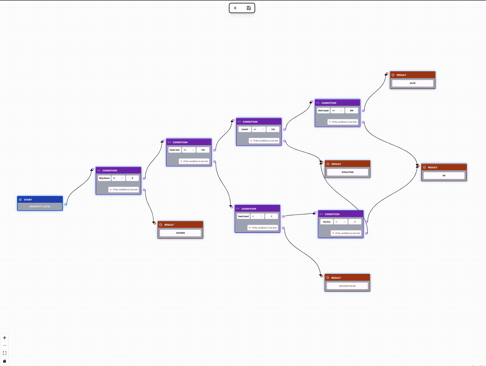

# Decision Flow App

Welcome to the **Decision Flow App**, where you can build, visualize, and automate decision-making policies. This app lets you define policies with configurable rules, create decision flows with a drag-and-drop interface, and test the outcomes like a true digital overlord.




## Features

- **Policy Management**: Create, edit, and list decision policies like a pro.
- **Visual Flow Builder**: Drag, drop, and connect blocks until it looks like a work of art (or spaghetti code, your call).
- **Automated Decisions**: Input variables, click a button, and let the app decide for you. No more thinking required!
- **Persistence & Scalability**: Backed by a robust API and database, so your brilliant logic doesn’t vanish into the void.

## Architecture

This project is split into two glorious halves:

### [Backend](./backend/ConfigBackend/README.md)
Manages your decision policies, stores rules, and provides the API for evaluating decisions. In other words, it does all the boring but necessary work.


### [Frontend](./frontend/README.md)
A fancy web interface where you can create, visualize, and test decision policies. Because staring at raw data in a terminal is so last century.


## Getting Started

You want to install and run this? Good choice. For setup and detailed usage instructions, check out the separate guides for the backend and frontend. I promise they contain actual useful information.

- [Backend Guide](./backend/ConfigBackend/README.md)
- [Frontend Guide](./frontend/README.md)

### ❗Docker Lifesaver

Don’t feel like going through a bunch of setup steps? No problem. There’s a perfectly functional docker-compose file right here that spins up everything—backend, frontend, and database.

Just run:

```sh
docker-compose up -d
```
And voilà! The app is up and running. Minimal effort, maximum results.

🔗 Access your application at http://localhost:5173.
