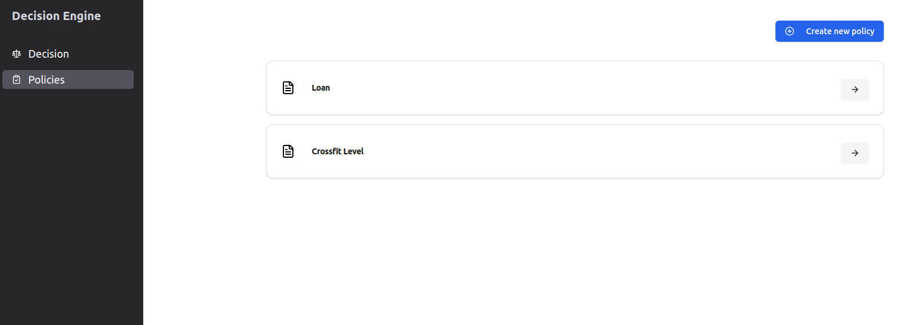
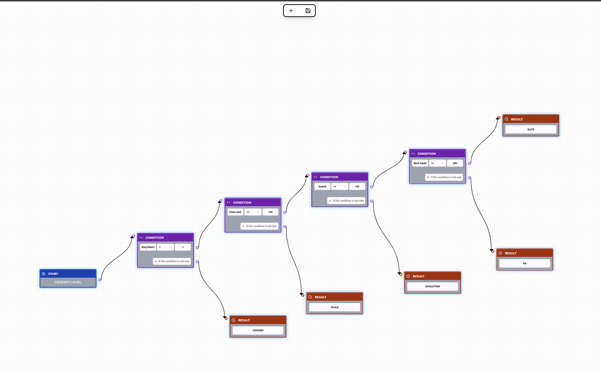
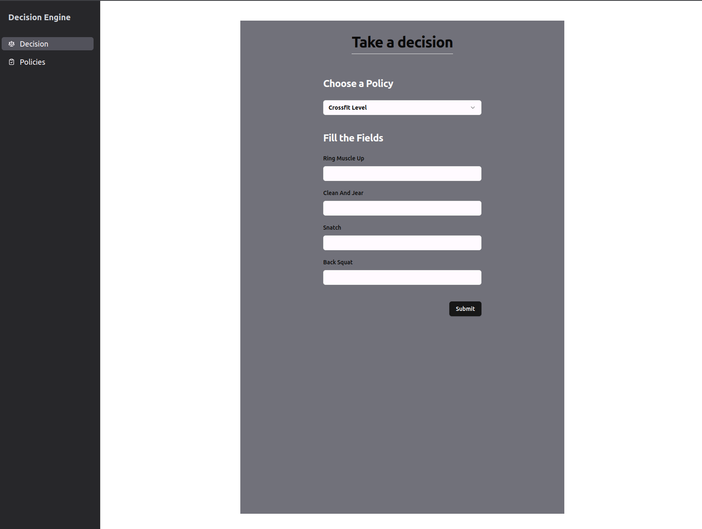
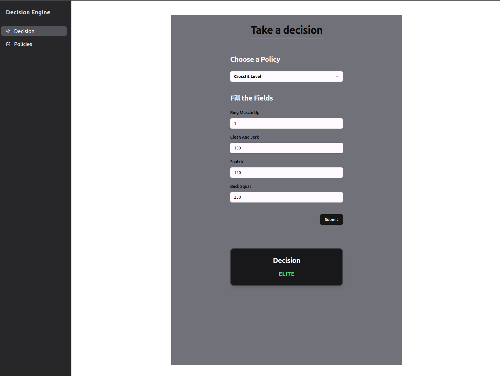

# **Frontend**

## Overview
This frontend lets you create, visualize, and test automated decision policies with an intuitive flow builder. Define policies, connect logic blocks, and test decisions effortlessly—all in a sleek and interactive interface.

Simple, fast, and (mostly) foolproof. 

## Tech Stack

- React (Vite)
- TypeScript
- ReactFlow
- Tailwind
- Shadcn

**No package manager is set. Feel free to use your personal favorite—because freedom matters.**

## Installation
```shell
npm install
```

## How to run
```shell
# "npm" is just an example. Use whatever package manager soothes your soul.
npm run dev
```

Now you can access the project at [http://localhost:5173/](http://localhost:5173/).

---

## Navigating the Project

You’ve got three major pages to play with:

### **1. /policies (which you'll land on by default, like magic)**



Here, you’ll see all the policies you’ve created (or none, if you’re just starting out). Click on any policy, and—voilà—a new tab opens, taking you straight to its decision flow.

Want to create a new policy? Hit that shiny blue button at the top, give it a meaningful name (because clean code, right?), and save it. That’s it. You’re officially a policymaker.

---

### **2. /policy/:id**



Welcome to the policy flow builder. Here’s what you need to know:

- The **Start Block** is always there, holding your policy’s name like a proud badge. You can’t delete it. Deal with it.
- From the Start Block, you get exactly **one** connection. No chaos allowed.
- **Condition Blocks** let you define conditions and set paths based on whether they are met. You get **two** connections here: one for when the condition matches and another for when it doesn’t. Chain them together, go wild (but not too wild).
- **Decision Blocks** represent the final outcome of a flow. Once a path reaches this block, a decision is made. Done and dusted.

At the top of your screen, you’ll see a toolbar:
- **The Plus (+) Icon** → Add Condition or Decision Blocks (because one is never enough).
- **The Save (💾) Icon** → Saves your masterpiece. Hit it often.

If your flow has inconsistencies—like loops, missing connections, or other chaotic mishaps—the system will let you know. No judgment, mistakes happen.

---

### **3. /decision**



You built a policy. You designed its flow. Now what? Time to test it.

Head over to **/decision**. You’ll find a dropdown listing all your policies. Pick one, and you’ll see a form with all the variables you set up earlier. Fill them out, hit submit, and watch your decision engine work its magic.



Congratulations, big champ. You just built an automated decision system. Go flex.

